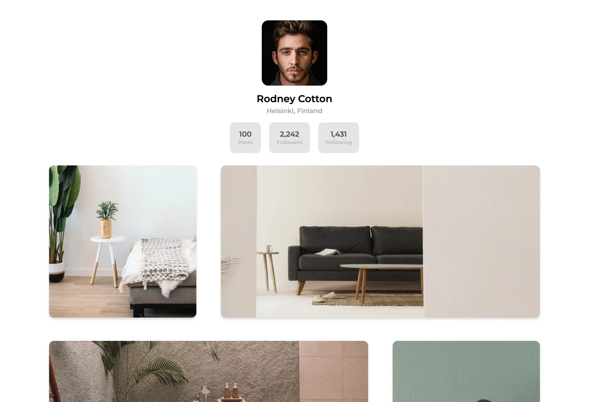

<!-- Please update value in the {}  -->

<h1 align="center">My Gallery</h1>

   Solution for a challenge from  <a href="http://devchallenges.io" target="_blank">Devchallenges.io</a>.

  <h3>
    <a href="https://dc-gallery.vercel.app/">
      Demo
    </a>
     | 
    <a href="https://github.com/Relmaur/DC-Gallery">
      Solution
    </a>
     | 
    <a href="https://devchallenges.io/solutions/6kTH3DsEJ4VmuE1FFqev">
      Challenge
    </a>
  </h3>

<!-- TABLE OF CONTENTS -->

## Table of Contents

- [Overview](#overview)
  - [Built With](#built-with)
- [Features](#features)
- [How to use](#how-to-use)
- [Contact](#contact)
- [Acknowledgements](#acknowledgements)

<!-- OVERVIEW -->

## Overview

Introduce your projects by taking a screenshot or a gif. Try to tell visitors a story about your project by answering:

- Where can I see your demo?
   :: Right in here! -> https://dc-interior-consultant.vercel.app/
- What was your experience?
   :: Hmm... It was great too!
- What have you learned/improved?
   :: Perhaps not to overlook the CSS resets, they are important indeed.
- Your wisdom? :)
   :: Well, I know a thing or two about the CSS, I'm constantly trying to implement new things.

### Built With

<!-- This section should list any major frameworks that you built your project using. Here are a few examples.-->

- [HTML](https://www.w3.org/html/)
- [SASS](https://sass-lang.com/)

## Features

<!-- List the features of your application or follow the template. Don't share the figma file here :) -->

This application/site was created as a submission to a [DevChallenges](https://devchallenges.io/challenges) challenge. The [challenge](https://devchallenges.io/challenges/TtUjDt19eIHxNQ4n5jps) was to build a page to complete the following user stories:

- [x] User story: I can see a page following the given design

## Contact

- GitHub [@Relmaur](https://github.com/Relmaur)
